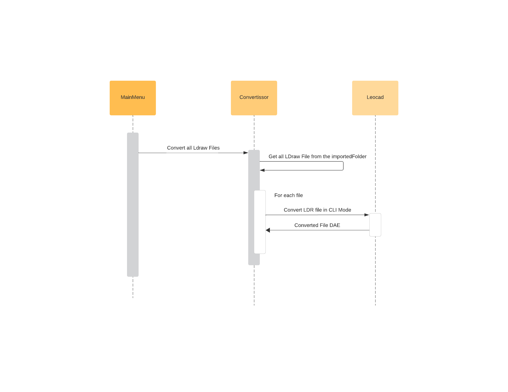
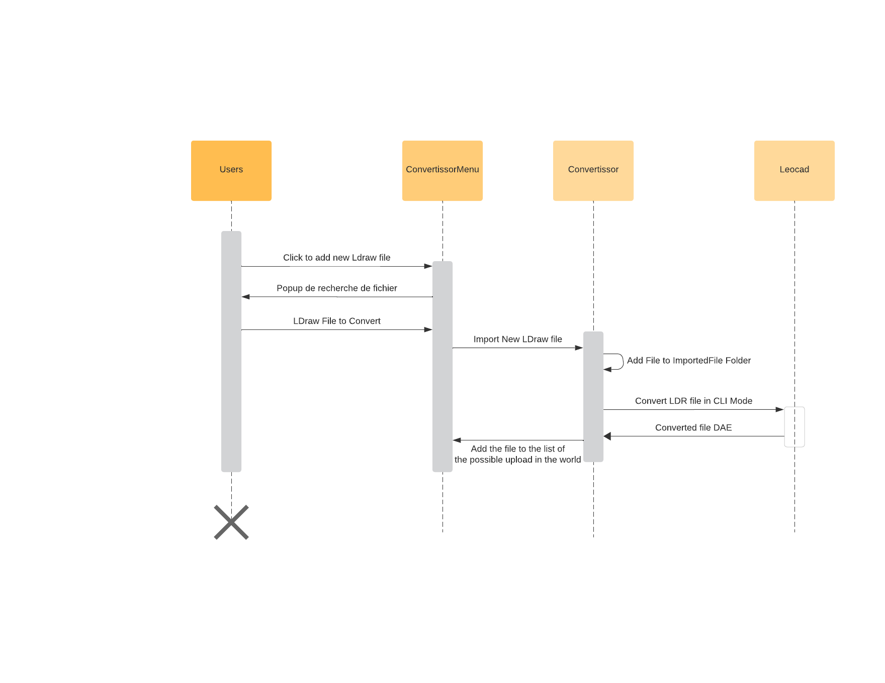

# LDraw to Collada Converter

## Introduction

This document serves as documentation for the implementation and usage of the LDraw to Collada Converter within our Godot Game. This converter facilitates the integration of LDraw models into our game environment.

## Required Software

- [LeoCAD](https://www.leocad.org/): This application is necessary for the conversion process, particularly for its CLI mode functionality.

## Conversion Process

The conversion process involves several steps:

1. **Optional**: Customers can create LDraw files using the LeoCAD application.
2. Upon game startup, all LDraw files are converted into Collada files (.dae) using a script that invokes LeoCAD in CLI mode.
3. During gameplay, customers can access the import menu by pressing *L* and select the desired model to spawn in the world.
4. Various settings can be adjusted, such as the behavior of the imported model.

## Customer Usage

To add new LDraw models into the game, customers need to place LDraw files into a specific directory **ImportedFiles** on their computer. The directory path varies depending on the operating system:

- **Windows**: %APPDATA%\OpenWorldLego\ImportedFiles\
- **macOS**: ~/Library/Application Support/OpenWorldLego/ImportedFiles/
- **Linux**: ~/.local/share/OpenWorldLego/ImportedFiles/

## Process of conversion

### Converting all at once

At the launch of the game, the scene mainMenu launch the convertion of all the LDraw file in the **ImportedFiles** directory. 

This is how the process goes :

### Convertion by Interface

We also, provide an interface to convert file without putting file in the **ImportedFiles** directory. In game, we can open the converting meny by pressing **L**.

This is how the process goes :

*NB : the menu also provide a way of uploading the converted file into the world in different way of uploading.*
## Areas for Improvement

One area for improvement is to make the LeoCAD conversion process headless, allowing customers to convert files without needing to install LeoCAD. This enhancement would increase accessibility and convenience for users.

---

Feel free to reach out if you have any questions or suggestions for further improvements!
